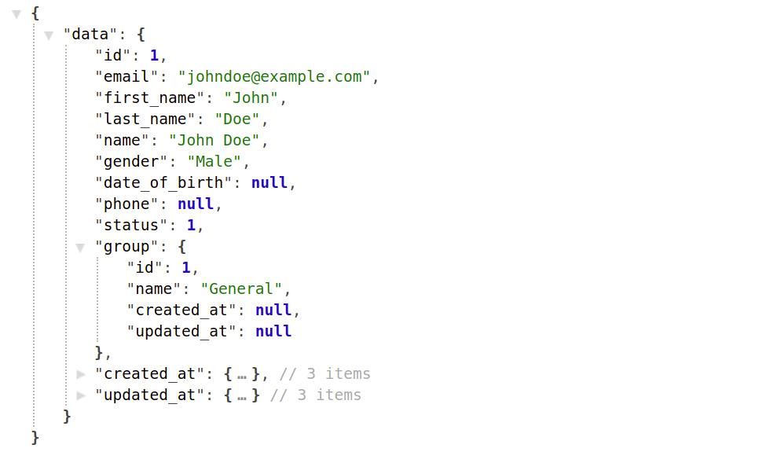

# How To Create Requests For Customers

    
    <a target="_blank" href="https://github.com/bagisto/bagisto-docs/blob/master/api_customer.md">edit on github</a>

In the customer's APIs: Firstly, we will look for the customer's authentication with the help of login credentials. Because customer can't access/add/modify their addresses, orders, reviews and wishlists without login into the front store. To logged in at the Bagisto front store, customer need a valid email address and password.

## 1. Customer's Login Authentication: 

> _http(s)://example.com/public/api/customer/login_

**Note**: _For the customer's login, you have to send your data `(i.e. email and password)` using `POST HTTP verb` ._

##### Request:
    {
        email:johndoe@webkul.com,
        password:******
    }

##### Response:

{:class="screenshot-dimension center"}

## 2. Customer's Reset Password: 

You can also use the API for reset the customer's password by providing the valid customer's email address. In this API request, you have to use `customer/forgot-password` resource with `email` as a Request Payload. An email will be send on the provided email address, only if the same email address will exist in the Bagisto Store.

> _http(s)://example.com/public/api/customer/forgot-password_

##### Request:

    {
        email: "johndoe@example.com"
    }

**Note**: _For the customer's `forgot-password` API call, you have to send your request data `(i.e. email)` using `POST HTTP verb` ._

##### Response:

    {
        "message": "We have e-mailed your password reset link!"
    }

{:class="screenshot-dimension center"}

- In case you provide an invalid or unregistered email address , then no email will be send to provided email address and response will be like:

##### Response:

    {
        "error": "We can't find a user with that e-mail address."
    }

{:class="screenshot-dimension center"}

## 3. Customer's Logout: 

You can use logout the customer from the Bagisto store with the help of `customer/logout` resource. No need to provide any request payload in the API call.

> _http(s)://example.com/public/api/customer/logout_

**Note**: _The customer's `logout` API call send through `GET HTTP verb` ._

##### Response:

    {
        "message": "Logged out successfully!"
    }

{:class="screenshot-dimension center"}

## 4. Get Customer's Information:

You can get the customer's information only for the logged in customer. To retrieve customer's information you can use the `customer/get` resource. This API call will return you the personal details of logged in customer.

> _http(s)://example.com/public/api/customer/get_

**Note**: _In the `customer/get` API call resource, we used `GET HTTP verb` to get the customer's profile information._

##### Response:

    {
        "data": {
            "id": 1,
            "email": "viveksh047@webkul.com",
            "first_name": "John",
            "last_name": "Doe",
            "name": "John Doe",
            "gender": "Male",
            "date_of_birth": null,
            "phone": null,
            "status": 1,
            "group": {
                "id": 1,
                "name": "General",
                "created_at": null,
                "updated_at": null
            },
            "created_at": {},
            "updated_at": {}
        }
    }

{:class="screenshot-dimension center"}

## 5. Modify Customer's Profile Details: 

You can update the customer's account information (only for the currently logged-in customer). To achieve this task, you can use the `customer/profile` API call resource. This API call will return you the personal details of login customer.

> _http(s)://example.com/public/api/customer/profile_

##### Request:

    {
        id: 1
        first_name: "John"
        last_name: "Doe"
        name: "John Doe"
        email: "johndoe@example.com"
        password: "******"
        password_confirmation: "******"
        gender: "Male"
        group: {...}
        date_of_birth: null
        phone: null
        status: 1
        created_at: {...}
        updated_at: {...}
    }

**Note**: _In the `customer/profile` resource API call, we used `PUT HTTP verb` to sent the customer's profile information for update._

##### Response:

    {
        "message": "Your account has been updated successfully.",
        "data": {
            id: 1
            first_name: "John",
            last_name: "Doe",
            name: "John Doe",
            email: "johndoe@example.com"
            phone: null,
            status: 1,
            ...
        }
    }

{:class="screenshot-dimension center"}

## 6. Customer Registration In Bagisto Store: 

You can create/register a new customer in the Bagisto store. To achieve this task, you can use the `customer/register` API call resource.

> _http(s)://example.com/public/api/customer/register_

##### Request:

    {
        email: "peterdoe@example.com"
        first_name: "Peter"
        last_name: "Doe"
        password: "******"
        password_confirmation: "******"
    }

**Note**: _In the `customer/register` resource API call, we used `POST HTTP verb` to sent the customer's information for registration._

##### Response:

    {
        message: "Your account has been created successfully."
    }

{:class="screenshot-dimension center"}

- In case there is already a customer in the Bagisto Store with the same email address for which you are going to create new customer, then you will get an error message in response like:

##### Response:

    {
        message: "The given data was invalid.",
        errors: {
            email: [
                "The email has already been taken."
                ]
        }
    }

{:class="screenshot-dimension center"}

## 7. Get Customer Information Based on Id: 

You can also get the customer information (like: `customer/get` resource) by using customer_id as a request payload. To achieve this task, you can use the `customers/{id}` API call resource.

> _http(s)://example.com/public/api/customers/{id}_

- This `customers/{id}` API call resource will return the customer's details only if the customer has logged in currently.

**Note**: _In the `customers/{id}` resource API call, we used `GET HTTP verb` to get the login customer's information._

##### Request:

> _http(s)://example.com/public/api/customers/1_

##### Response:

    {
        "data": {
            "id": 1,
            "email": "johndoe@example.com",
            "first_name": "John",
            "last_name": "Doe",
            "name": "John Doe",
            "gender": "Male",
            "date_of_birth": null,
            "phone": null,
            "status": 1,
            "group": {
                "id": 1,
                "name": "General",
                "created_at": null,
                "updated_at": null
            },
            "created_at": {},
            "updated_at": {}
        }
    }

{:class="screenshot-dimension center"}
