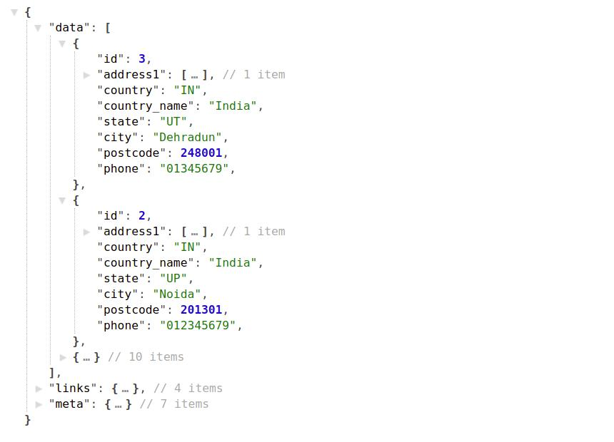
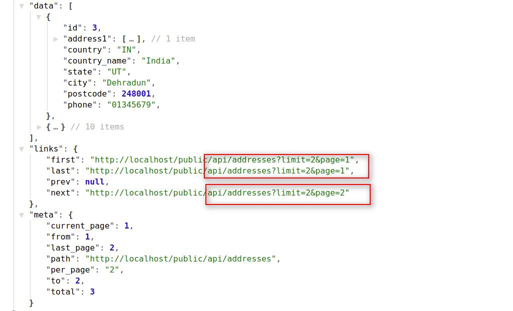
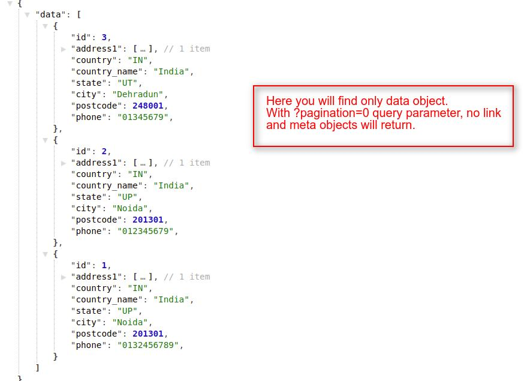
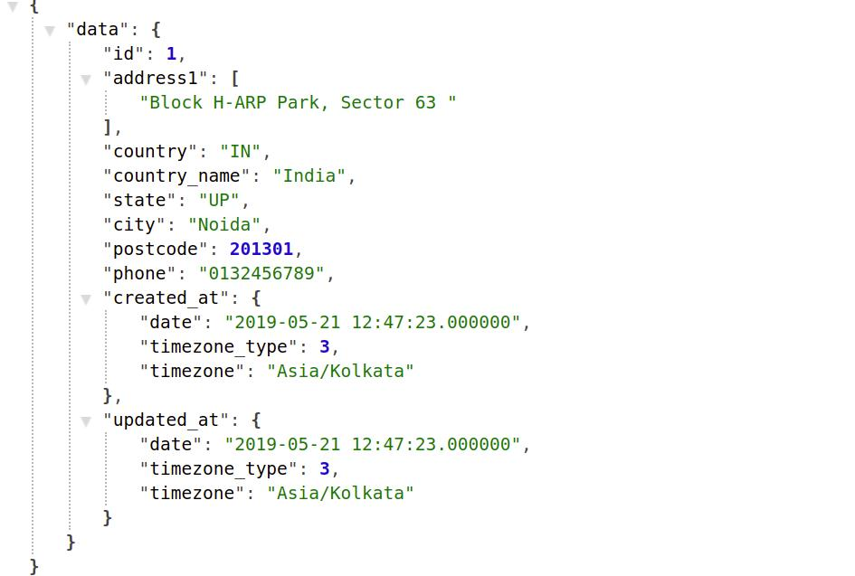
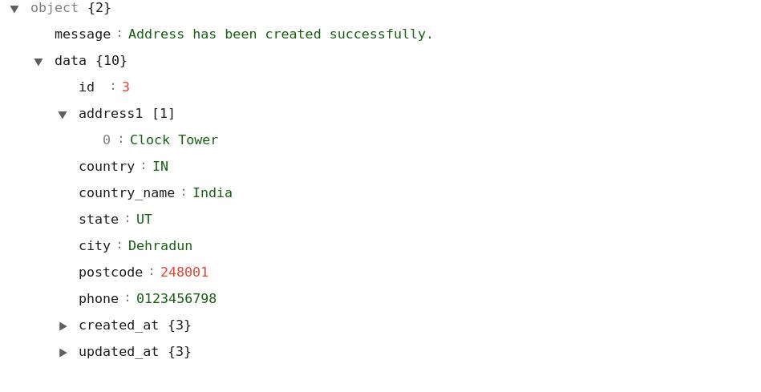

# How To Requests For Customer's Addresses
{:.pencil-icon}
[edit on github](https://github.com/bagisto/bagisto-docs/blob/master/api_customer_addresses.md){:class="edit-github" target="_blank"}

## 1. Get All Addresses of LoggedIn Customer:
You can get all the addresses of the customers in Bagisto Store. To get the address of a customer, that customer must be logged into the Bagisto Store. You can achieve this job by using `addresses` API call resource.

> *http(s)://example.com/public/api/addresses*

**Note: In the `addresses` resource API call, we used `GET HTTP verb` to get all the addresses of the login customer.**

###### Request:

> *http(s)://example.com/public/api/addresses*

###### Response:
    {
        "data": [
            {
                "id": 3,
                "address1": [...],
                "country": "IN",
                "country_name": "India",
                "state": "UT",
                "city": "Dehradun",
                "postcode": 248001,
                "phone": "01345679",
            },
            {
                "id": 2,
                "address1": [...],
                "country": "IN",
                "country_name": "India",
                "state": "UP",
                "city": "Noida",
                "postcode": 201301,
                "phone": "012345679",
            },
            {...}
        ],
        "links": {...},
        "meta": {...}
    }

{:class="screenshot-dimension center"}

### 1.1 Get Addresses With Pagination: 

> *http(s)://example.com/public/api/addresses?page=1*

> *http(s)://example.com/public/api/addresses?limit=5&page=1*

**Note: If you didn't use the page(?page=x) filter, then it returns the data of the first page by default. You can also provide the limit request parameter in the API url.**

{:class="screenshot-dimension center"}

###### Explanation:

* In the above response, you will find the three Objects with below mentioned indexes:
    1. data
    2. link
    3. meta

#### data object:

Under the data object, you will find the collection of many objects which will contain the details of address of the logged in customer. you can use the addresses index data by accessing these addresses sub-objects.

**Note: Regarding both link and meta objects, we already explained these objects functionality in <a href="api_category.html#link-object" target="_blank" class="bagsito-link"> Category API </a> section.**

### 1.2 Get Addresses Without Pagination:
You can also get all the addresses at once without pagination of a customer from Bagisto Store. To get the addresses of a customer, that customer must be logged in Bagisto Store,for this you have to pass **`pagination=0`** in the query parameter in API URL.

###### Request:

> *http(s)://example.com/public/api/addresses?pagination=0*

##### Response:
    {
        "data": [
            {
                "id": 3,
                "address1": [...],
                "country": "IN",
                "country_name": "India",
                "state": "UT",
                "city": "Dehradun",
                "postcode": 248001,
                "phone": "01345679",
            },
            {
                "id": 2,
                "address1": [...],
                "country": "IN",
                "country_name": "India",
                "state": "UP",
                "city": "Noida",
                "postcode": 201301,
                "phone": "012345679",
            },
            {...}
        ]
    }

{:class="screenshot-dimension center"}

## 2. Get Specific Address Based On Address Id: 
To get the customer's specific address, you have to pass an address_id as a request payload like **`addresses/{address_id}`** in API url. By using this resource and request payload, you will get only `a single object` under **`data object`** in response.

> *http(s)://example.com/public/api/addresses/{id}*

* This `addresses/{id}` API call resource will return the customer's address details, only if the customer has logged in currently into the store.

**Note: In the `addresses/{id}` resource API call, we used `GET HTTP verb` to get the login customer's address.**

##### Request:

> *http(s)://example.com/public/api/addresses/1*

##### Response:
    {
        "data": {
            "id": 1,
            "address1": [
                "Block H-ARP Park, Sector 63 "
            ],
            "country": "IN",
            "country_name": "India",
            "state": "UP",
            "city": "Noida",
            "postcode": 201301,
            "phone": "0132456789",
            "created_at": {...},
            "updated_at": {...}
        }
    }

{:class="screenshot-dimension center"}

## 3. Modify Specific Address Based On Address Id: 
To update the customer's specific address, you have to pass an address_id as a request payload like **`addresses/{address_id}`** in API url.

> *http(s)://example.com/public/api/addresses/{id}*

* This `addresses/{id}` API call resource will modify the customer's address details, only if the customer has logged in currently into the store.

**Note: In the `addresses/{id}` resource API call, we used `PUT HTTP verb` to update the login customer's address.**

##### Request:

> *http(s)://example.com/public/api/addresses/1*
    {
        id: 3
        address1: [
            "Clock Tower"
            ]
        city: "Dehradun"
        country: "IN"
        country_name: "India"
        phone: "0123456798"
        postcode: 248001
        state: "UT"
        created_at: {...}
        updated_at: {...}
    }

##### Response:
    {
        "message":"Your address has been updated successfully.",
        "data": {...} // Address's detail.
    }

{:class="screenshot-dimension center"}

## 4. Create A New Address Of Customer: 
You can also create a new address of a login customer. To add address, you have to use **`addresses/create`** resource in API url and have to pass the address fields in Request Payload.

> *http(s)://example.com/public/api/addresses/create*

* This `addresses/create` API call resource will create a new address of the customer, only if that customer has logged in the store.

**Note: In the `addresses/create` resource API call, we used `POST HTTP verb` to create new customer's address.**

##### Request:

> *http(s)://example.com/public/api/addresses/create*
    {
        address1: [
            "Clock Tower"
            ]
        city: "Dehradun"
        country: "IN"
        country_name: "India"
        phone: "0123456798"
        postcode: 248001
        state: "UT"
    }

##### Response:
    {
        "message":"Address has been created successfully.",
        "data": {...} // Address's detail.
    }

{:class="screenshot-dimension center"}