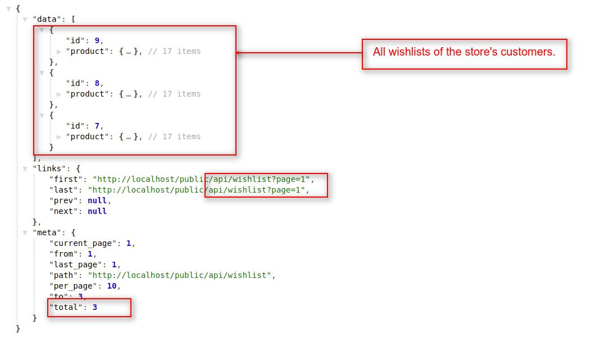
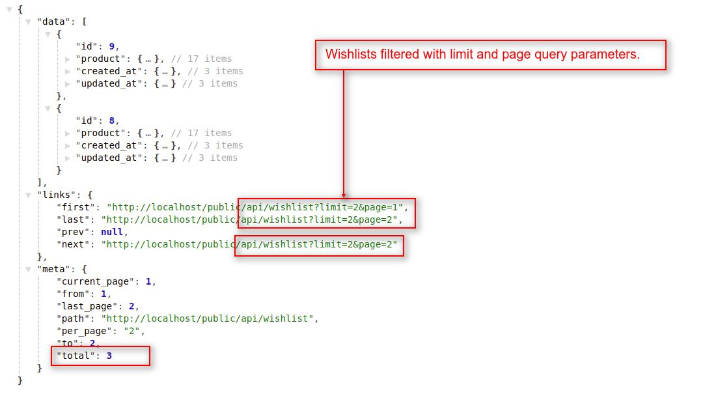
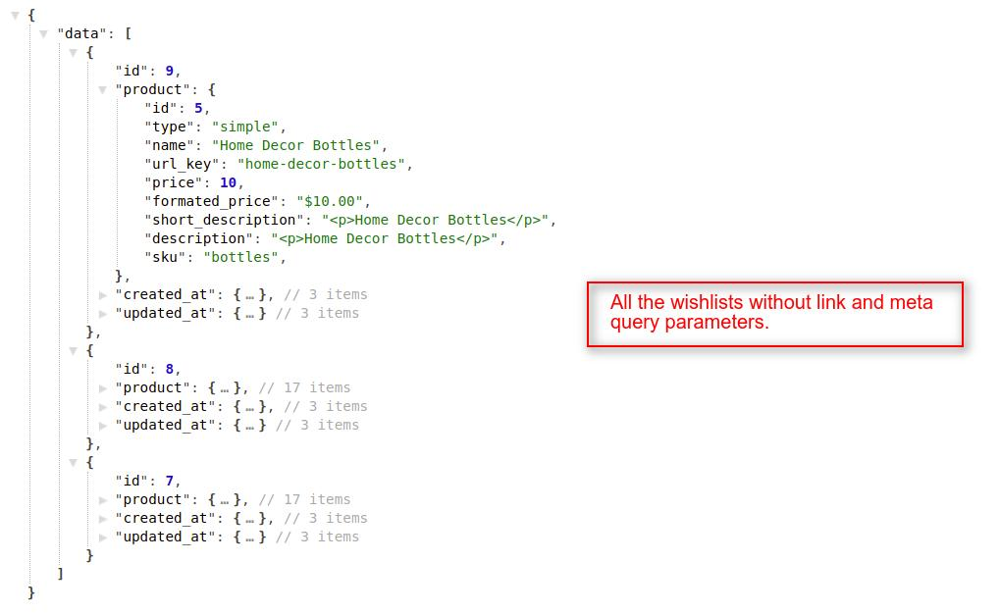
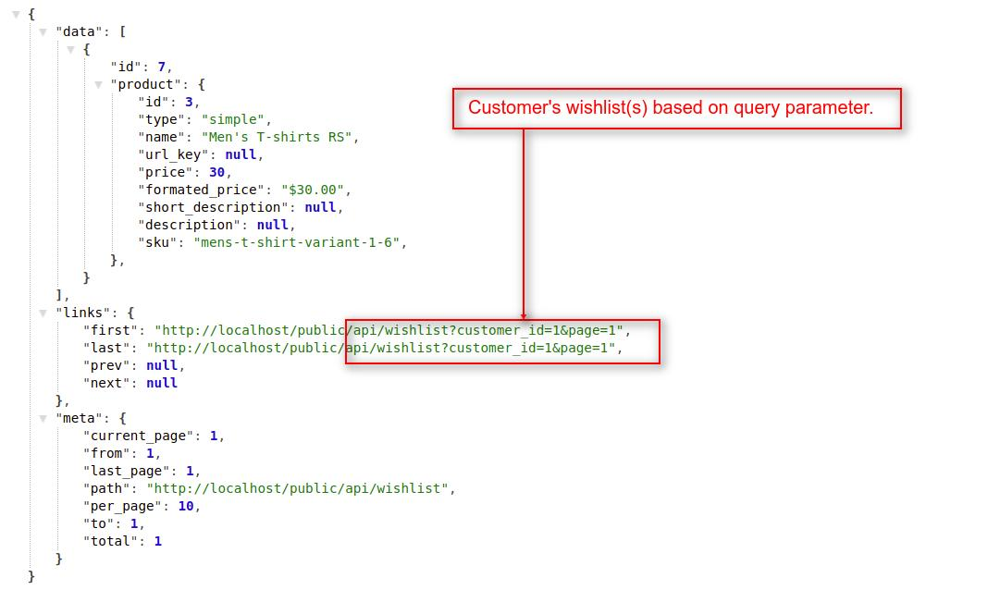
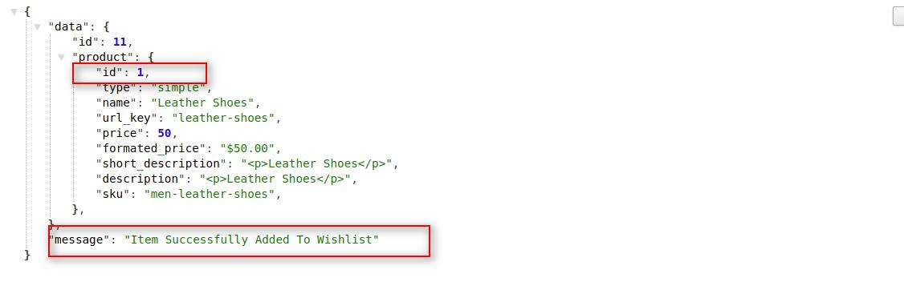

# How To Requests For Customer's Wishlist

{:.pencil-icon}
[edit on github](https://github.com/bagisto/bagisto-docs/blob/master/api_customer_wishlist.md){:class="edit-github" target="\_blank"}

## 1. Get All Customer's Wishlists: 

You can get all the wishlists of Bagisto Store's customers. To call this API customer must be logged-in to the Bagisto Store. You can achieve this job by using `wishlist` API call resource.

**Note**: _In the `wishlist` resource API call, we used `GET HTTP verb` to get all the wishlist of Bagisto's Store customers._

###### Request:

> _http(s)://example.com/public/api/wishlist_

###### Response:

    {
        "data": [
            {
                "id": 9,
                "product": {}
            },
            {
                "id": 8,
                "product": {}
            },
            {
                "id": 7,
                "product": {}
            }
        ],
        "links": {
            "first": "http://localhost/public/api/wishlist?page=1",
            "last": "http://localhost/public/api/wishlist?page=1",
            "prev": null,
            "next": null
        },
        "meta": {
            "current_page": 1,
            "from": 1,
            "last_page": 1,
            "path": "http://localhost/public/api/wishlist",
            "per_page": 10,
            "to": 3,
            "total": 3
        }
    }

{:class="screenshot-dimension center"}

### 1.1 Get Wishlists With Pagination: 

> _http(s)://example.com/public/api/wishlist?page=1_

> _http(s)://example.com/public/api/wishlist?limit=5&page=1_

**Note**: _If you didn't use the page(?page=x) filter, then it returns the data of the first page by default. You can also provide the limit request parameter in the API url._

{:class="screenshot-dimension center"}

###### Explanation:

- In the response above, you will find the three Objects with the indexes mentioned below:
  1. data
  2. link
  3. meta

#### Data Object:

Under the data object, you will find the collection of many objects which will contain the details of wishlists of the store's customer.

**Note**: _Regarding both link and meta objects, we already explained these objects functionality in_ <a href="api_category.html#link-object" target="_blank" class="bagsito-link"> _Category API_ </a> _section_

### 1.2 Get Wishlists Without Pagination: 

You can also get all the wishlists of Store's customers at once without pagination. To get the wishlists, customer must be logged-in to the Bagisto Store. For this you have to pass **`pagination=0`** in the query parameter in API URL.

###### Request:

> _http(s)://example.com/public/api/wishlist?pagination=0_

##### Response:

    {
        "data": [
            {
                "id": 9,
                "product": {
                    "id": 5,
                    "type": "simple",
                    "name": "Home Decor Bottles",
                    "url_key": "home-decor-bottles",
                    "price": 10,
                    "formated_price": "$10.00",
                    "short_description": "
Home Decor Bottles
",
                    "description": "
Home Decor Bottles
",
                    "sku": "bottles",
                }
            },
            {
                "id": 8,
                "product": {}
            },
            {
                "id": 7,
                "product": {}
            }
        ]
    }

{:class="screenshot-dimension center"}

## 2. Get all Wishlists Of A Customer: 

To get all wishlists of a specific customer, you have to pass a `customer_id` as a query parameter like **`wishlist?customer_id={id}`** in API url. By using this resource and query parameter, you will get a array of wishlist(s) objects of a customer under **`data object`** in response.

> _http(s)://example.com/public/api/wishlist?customer_id={id}_

**Note**: _In the `wishlist/?customer_id={id}` resource API call, we used `GET HTTP verb` to get all the wishlist(s) of a customer._

##### Request:

> _http(s)://example.com/public/api/wishlist?customer_id=1_

##### Response:

    {
        "data": [
            {
                "id": 7,
                "product": {...},
            }
        ],
        "links": {
            "first": "http://localhost/public/api/wishlist?customer_id=1&page=1",
            "last": "http://localhost/public/api/wishlist?customer_id=1&page=1",
            "prev": null,
            "next": null
        },
        "meta": {
            "current_page": 1,
            "from": 1,
            "last_page": 1,
            "path": "http://localhost/public/api/wishlist",
            "per_page": 10,
            "to": 1,
            "total": 1
        }
    }

{:class="screenshot-dimension center"}

## 3. Add Product To Wishlist: 

To add a product to customer's wishlist, you have to pass a `product_id` as a request payload like **`wishlist/add/{id}`** in API url.

> _http(s)://example.com/public/api/wishlist/add/{id}_

- This `wishlist/add/{id}` API call resource will add a new wishlist for a specific product, only if the customer has logged in currently into the store.

**Note**: _In the `wishlist/add/{id}` resource API call, we used `GET HTTP verb` to add a new wishlist for a login customer._

##### Request:

> _http(s)://example.com/public/api/wishlist/add/{id}_

##### Response:

    {
        "data": {
            "id": 11,
            "product": {
                "id": 1,
                "type": "simple",
                "name": "Leather Shoes",
                "url_key": "leather-shoes",
                "price": 50,
                "formated_price": "$50.00",
                "short_description": "
Leather Shoes
",
                "description": "
Leather Shoes
",
                "sku": "men-leather-shoes"
            }
        },
        "message": "Item Successfully Added To Wishlist"
    }

{:class="screenshot-dimension center"}
