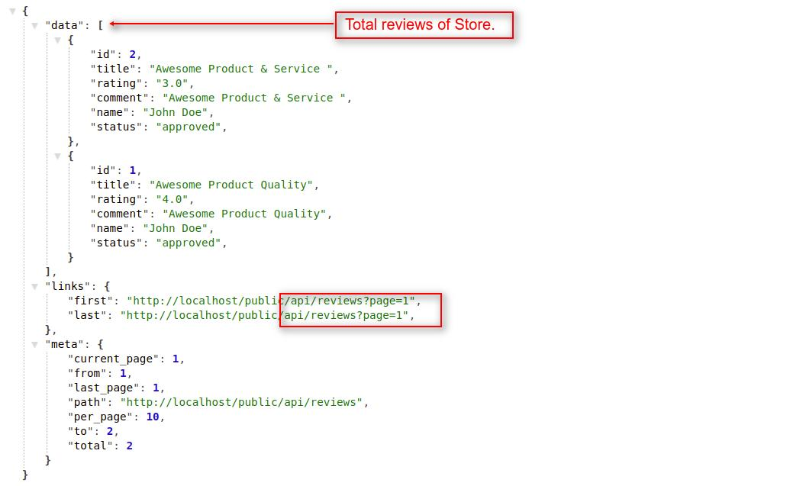

# How To Requests For Product's Reviews

    
    <a href="https://github.com/bagisto/bagisto-docs/blob/master/api_product_review.md" target="_blank">edit on github</a>

## 1. Get All Bagisto's Reviews: 

You can get all the reviews of the Bagisto Store. You can achieve this job by using **`reviews`** API call resource.
Currently, this **`reviews`** resource is helpful for both admin user and customer too. There is no need of customer authentication.

> _http(s)://example.com/public/api/reviews_

**Note**: _In the `reviews` resource API call, we used `GET HTTP verb` to get all the reviews of the Bagisto Store_.

###### Request:

> _http(s)://example.com/public/api/reviews_

###### Response:

    {
        "data": [
            {
                "id": 4,
                "title": "Great product & Service!!!",
                "rating": "4.0",
                "comment": "Beautiful bangles. Better than I expected.",
                "name": "John Doe",
                "status": "approved",
            },
            {
                "id": 3,
                "title": "Very good product.. Recommend to all",
                "rating": "5.0",
                "comment": "I have ordered 2 sets. The product i received was good, i loved it.",
                "name": "Peter Doe",
                "status": "approved",
            },
            {
                "id": 2,
                "title": "Awesome Product & Service ",
                "rating": "3.0",
                "comment": "Awesome Product & Service ",
                "name": "John Doe",
                "status": "approved",
            },
            {...},
            {...}
        ],
        "links": {
            "first": "http://localhost/public/api/reviews?page=1",
            "last": "http://localhost/public/api/reviews?page=1",
        },
        "meta": {...}
    }

{:class="screenshot-dimension center"}

### 1.1 Get Reviews With Pagination: 

You can get store's review according to the pagination. You can define the limit that how many records you want in each page.

###### Request:

> _http(s)://example.com/public/api/reviews?page=1_

> _http(s)://example.com/public/api/reviews?limit=3&page=1_

**Note**: _If you didn't use the page(?page=x) filter, then it returns the data of the first page by default. You can also provide the limit request parameter in the API url._

###### Response:

    {
        "data": [
            {
                "id": 2,
                "title": "Awesome Product & Service ",
                "rating": "3.0",
                "comment": "Awesome Product & Service ",
                "name": "John Doe",
                "status": "approved",
            },
            {
                "id": 1,
                "title": "Awesome Product Quality",
                "rating": "4.0",
                "comment": "Awesome Product Quality",
                "name": "John Doe",
                "status": "approved",
            }
        ],
        "links": {
            "first": "http://localhost/public/api/reviews?limit=2&page=1",
            "last": "http://localhost/public/api/reviews?limit=2&page=2",
            "prev": "http://localhost/public/api/reviews?limit=2&page=1",
            "next": null
        },
        "meta": {...}
    }

{:class="screenshot-dimension center"}

##### Explanation:

- In the response above, you will find the three Objects with the indexes mentioned below:
  1. data
  2. link
  3. meta

#### Data Object:

Under the data object, you will find a array of multiple objects which contain the details of the store's reviews. You can use these objects to access the data of each individual review.

**Note**: _Regarding both link and meta objects, we already explained these objects functionality in_ <a href="api_category.html#link-object" target="_blank" class="bagsito-link"> _Category API_ </a> _section._

### 1.2 Get Reviews Without Pagination: 

You can also get all the reviews of Bagisto Store in a single API call without pagination. For this you have to pass **`pagination=0`** in the query parameter with the **`reviews`** resource in API URL.

###### Request:

> _http(s)://example.com/public/api/reviews?pagination=0_

##### Response:

    {
        "data": [
            {
                "id": 4,
                "title": "Great product & Service!!!",
                "rating": "4.0",
                "comment": "Beautiful bangles. Better than I expected.",
                "name": "John Doe",
                "status": "approved",
            },
            {...},
            {...},
            {...}
        ]
    }

{:class="screenshot-dimension center"}

## 2. Get Specific Review Based on Review Id: 

To get the specific review detail, you have to pass a review id i.e. **`id`** as a request payload like **`reviews/{id}`** in API url. By using this resource and request payload, you will get only `a single object` under **`data object`** in response.

> _http(s)://example.com/public/api/reviews/{id}_

**Note**: _In the `reviews/{id}` resource API call, we used `GET HTTP verb` to get the single review of Bagisto Store._

##### Request:

> _http(s)://example.com/public/api/reviews/2_

##### Response:

    {
        "data": {
            "id": 2,
            "title": "Awesome Product & Service ",
            "rating": "3.0",
            "comment": "Awesome Product & Service ",
            "name": "John Doe",
            "status": "approved",
            "product": {...},
            "customer": {...}
        }
    }

{:class="screenshot-dimension center"}

## 3. Get All Reviews Of Specific Product: 

To get all the reviews of a specific product, you have to pass a **`product_id`** as a query parameter like **`reviews?product_id={id}`** in API url. To use this API call customer authentication is not required.

> _http(s)://example.com/public/api/reviews?product_id={id}_

**Note**: _In the `reviews?product_id={id}` resource API call, we used `GET HTTP verb` to get all the reviews of a product._

##### Request:

> _http(s)://example.com/public/api/reviews?product_id=6_

##### Response:

    {
        "data": [
            {
                "id": 4,
                "title": "Great product & Service!!!",
                "rating": "4.0",
                "comment": "Beautiful bangles. Better than I expected.",
                "name": "John Doe",
                "status": "approved",
                "product": {...},
            },
            {
                "id": 3,
                "title": "Very good product.. Recommend to all",
                "rating": "5.0",
                "comment": "I have ordered 2 sets. The product i received was good, i loved it..",
                "name": "Peter Doe",
                "status": "approved",
                "product": {...},
            }
        ],
        "links": {
            "first": "http://localhost/public/api/reviews?product_id=6&limit=5&status=approved&page=1",
            "last": "http://localhost/public/api/reviews?product_id=6&limit=5&status=approved&page=1",
        },
        "meta": {...}
    }

{:class="screenshot-dimension center"}
