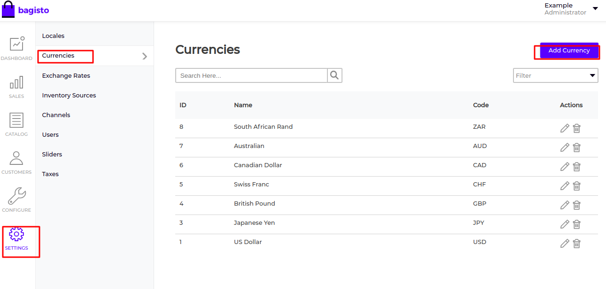
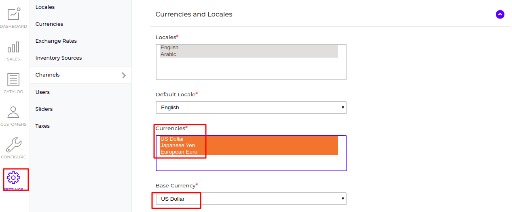
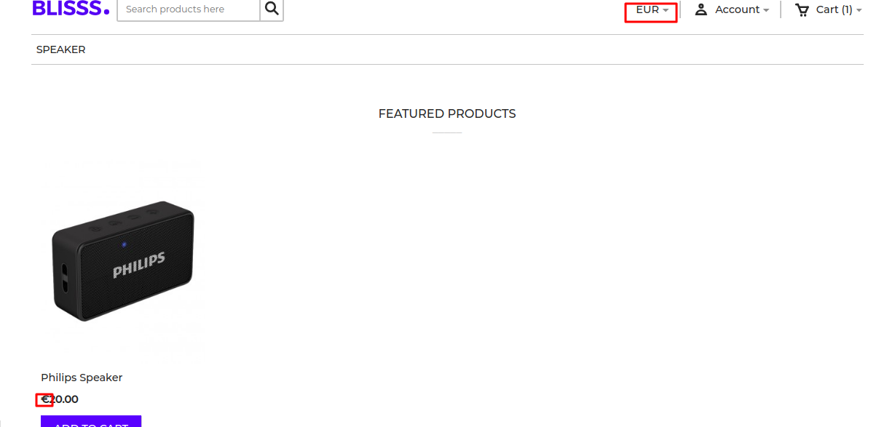
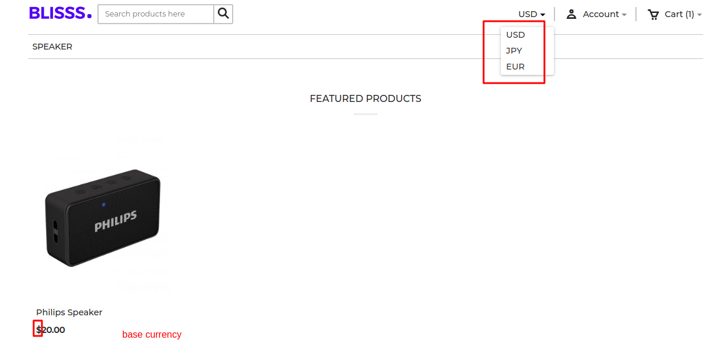
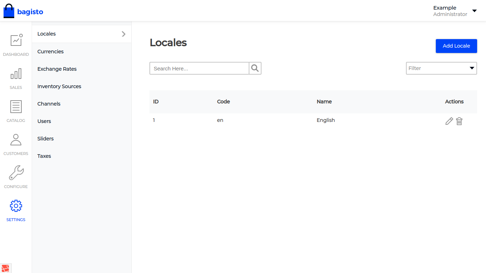
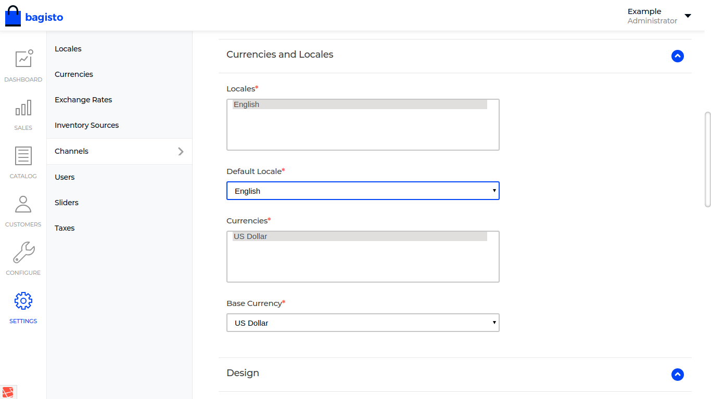
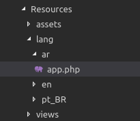
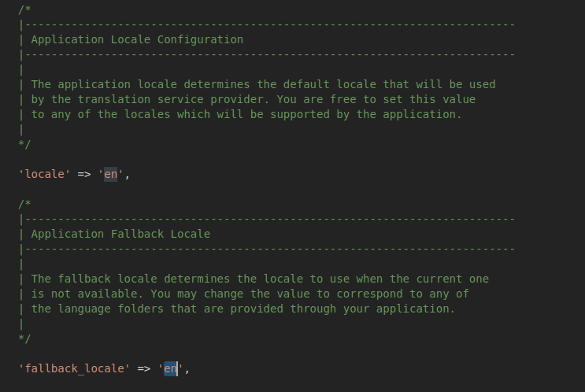

## How to Configure Settings

### Add Currency <a href="https://github.com/bagisto/bagisto-docs">Edit On github</a>

Before launching ecommerce store, it has been crucial decision to decide the currency to be used all over store. And, for providing ease to store owner to perform trade in multiple countries with their currency format

 > In admin panel, Click on Setting >> Currencies >> Add Currency

#### Channel Setting For Currency

Click on Setting >> open the selected channel in Edit Mode

* Currency:- You can select or multi-select currency as per your choice.

* Base Currency:- You have to set your Base currency that will be applicable throughout your eCommerce ecosystem as the default currency.

Once the channel setting has been done click on Save Channel

{: height="50%" width="50%" border="1px solid"}

{: height="50%" width="50%" border="1px solid"}

{: height="50%" width="50%" border="1px solid"}

{: height="50%" width="50%" border="1px solid"}

{: height="50%" width="50%" border="1px solid"}

#### Front End:-

At the top of the front end, there is an option of currency so you can select your currency.

### Add Language

Language file creation demonstration

### Add Locale

Locale is something that determines about the language of store.
Locale Configuration is provided in admin panel settings menu. By default, we have choosen `English` as locale. You may create as many as locale for your store.

{: height="100%" width="100%" border="1px solid"}

#### Steps to create and apply locale

Below, their are some steps that should be followed in accordance to create and turns store language for locale created :-

1. The admin have to create locales from admin section from settings.The locale created from admin panel will

2. The admin need to register his locale code within config/app.php file of root

3. Now, at last to turn language of store to created locale, admin should go to settings/channels in admin panel and perform editting for particular channel selected.

4. On clicking on `pencil icon`, admin will be redirected to edit form where admin have to choose particular locale-name in `Locales and Default Locale` fields of form

{: width="100%" height="100%"}

{: width="50%" height="50%"}

{: width="50%" height="50%"}

### Add Channel

