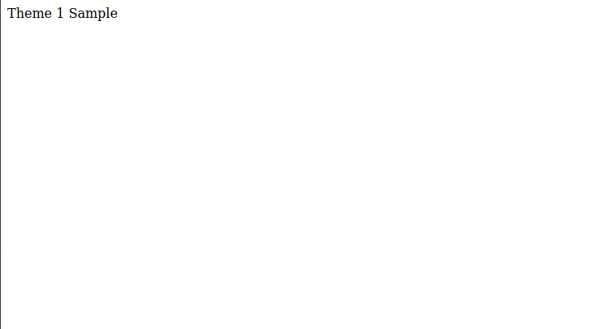

## Create Admin Theme

{:.pencil-icon}
[edit on github](https://github.com/bagisto/bagisto-docs/blob/master/create_theme.md){:.edit-github target="\_blank"}

We hope that, you know how to create a package, if not refer to [Package Development](create_package.md){: target="\_blank" .link-color}.

### Steps to create an Admin Theme

- In the Bagisto root directory go to the config file i.e. `config/themes.php`.

- Now search for the keys `admin-default` and `admin-themes`. It will look like this,
  
  ~~~php
  <?php
    return [
        ...
        'admin-default' => 'default',

        'admin-themes' => [
            'default' => [
                'views_path' => 'resources/admin-themes/default/views',
                'assets_path' => 'public/admin-themes/default/assets',
                'name' => 'Default'
            ]
        ]
        ...
    ];
  ~~~

  - **`admin-default`**: It is use to set the current theme.
  - **`admin-themes`**: It is use to store list of themes.

- Now add one more theme into the `admin-themes`.

    ~~~php
    <?php
        return [
            ...
            'admin-default' => 'default',

            'admin-themes' => [
                'default' => [
                    'views_path' => 'resources/admin-themes/default/views',
                    'assets_path' => 'public/admin-themes/default/assets',
                    'name' => 'Default'
                ],
                'theme1' => [
                    'views_path' => 'resources/admin-themes/theme1/views',
                    'assets_path' => 'public/admin-themes/theme1/assets',
                    'name' => 'Theme 1'
                ]
            ]
            ...
        ];
    ~~~

- As you see we have added view and assets path in the `theme1` array. Now set your views and assets folder according to your mentioned path.

  - Resources structure will look like this,

    ~~~php
    - resources
      - admin-themes
        - theme1
          - views
    ~~~

  - Assets structure will look like this,

    ~~~php
    - public
      - admin-themes
        - theme1
          - assets
    ~~~

- Now lets replace the dashboard page. Just create the exact dashboard's directory structure for `theme1` as present in `default`.  So it will look like this,

    ~~~php
    - resources
      - admin-themes
        - theme1
          - views
            - dashboard
                - index.blade.php
    ~~~

- Add some lines to the `index.blade.php`,

    ~~~php
    Theme 1 Sample
    ~~~

- Now everything is setup. Just one thing is pending i.e. we need to activate the theme. So, for that we need to change the `admin-default` key in file `config/themes.php`.

    ~~~php
    ...
    'admin-default' => 'theme1',
    ...
    ~~~

- Now check the dashboard page.
  
  {: width="30%" height="50%" .center}
