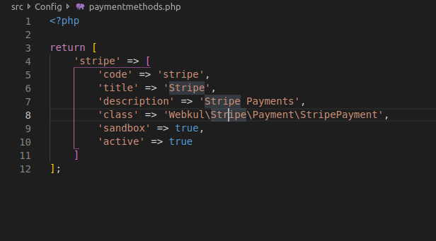

## Payment Method

{:.pencil-icon}
[edit on github](https://github.com/bagisto/bagisto-docs/blob/master/create_payment_method.md){:.edit-github target="\_blank"}

We hope that now you know how to create a package, if not refer to [Package development](create_package.md){: target="\_blank" .link-color}.

Bagisto eases the task of creating payment methods so a novice developer or professional developer can easily create payment methods. As the diversity of payment methods provide the options to customer for payment when they proceed to checkout. On another perspective, multiple payment methods are a great strategy to reach out to the global marketplace.

In this article, we will understand how to create a payment method. You can create a payment method in two ways.

1. By using Bagisto Package Generator (**Recommended**)
2. By manually setting up all files (**Expert Level**)

### 1. By using Bagisto Package Generator

For creating payment method package, you need to use this command in bagisto root directory,

~~~php
php artisan package:make-payment-method ModuleName
~~~

This will generate whole directory structures. You don't need to do manually.

### 2. By manually setting up all files

#### Steps to create a payment method

- Create respective directory structure to create your payment method.
  - module-name/
    - src/
      - Config/
        - system.php
        - paymentmethods.php
      - Database/
      - Http/
        - Controllers/
        - Routes/
      - Listeners/
      - Payment/
      - Models/
      - Providers/
        - ModuleServiceProvider.php
        - EventServiceProvider.php
      - Repositories/
      - Resources/
        - assets/
        - lang/
        - views/

- Within **Config** folder, it contains application's configuration files. Let's just create two files as **_system.php_** and **_paymentmethods.php_**

    1. <b>system.php</b>

        - Inside the file, you can include the code below as shown in image

        ~~~php
            <?php
                return [
                    [
                        'key'    => 'sales.paymentmethods.paypal_standard',
                        'name'   => 'admin::app.admin.system.paypal-standard',
                        'sort'   => 3,
                        'fields' => [
                            [
                                'name'          => 'title',
                                'title'         => 'admin::app.admin.system.title',
                                'type'          => 'text',
                                'validation'    => 'required',
                                'channel_based' => false,
                                'locale_based'  => true,
                            ], [
                                'name'          => 'description',
                                'title'         => 'admin::app.admin.system.description',
                                'type'          => 'textarea',
                                'channel_based' => false,
                                'locale_based'  => true,
                            ],  [
                                'name'       => 'business_account',
                                'title'      => 'admin::app.admin.system.business-account',
                                'type'       => 'select',
                                'type'       => 'text',
                                'validation' => 'required',
                            ],  [
                                'name'          => 'active',
                                'title'         => 'admin::app.admin.system.status',
                                'type'          => 'boolean',
                                'validation'    => 'required',
                                'channel_based' => false,
                                'locale_based'  => true
                            ], [
                                'name'          => 'sandbox',
                                'title'         => 'admin::app.admin.system.sandbox',
                                'type'          => 'boolean',
                                'validation'    => 'required',
                                'channel_based' => false,
                                'locale_based'  => true,
                            ], [
                                'name'    => 'sort',
                                'title'   => 'admin::app.admin.system.sort_order',
                                'type'    => 'select',
                                'options' => [
                                    [
                                        'title' => '1',
                                        'value' => 1,
                                    ], [
                                        'title' => '2',
                                        'value' => 2,
                                    ], [
                                        'title' => '3',
                                        'value' => 3,
                                    ], [
                                        'title' => '4',
                                        'value' => 4,
                                    ],
                                ],
                            ]
                        ]
                    ]
                ];
        ~~~

        <!-- {: .screenshot-dimension .center} -->

        <b>Explanation for the keys:</b>

        - <b>key:</b> these values provided are unique and concatenated with '.' (dot) operator. After the creation of two nested, other keys written are display in the browser in the form of accordion

        - <b>name:</b> these keys accept the value as a placeholder of your configuration. Generally, in bagisto, we consider writing it using translation.

        - <b>sort:</b> these keys accept the sort position for the configuration menu.

        - <b>fields</b> these keys accept the array for the value of the custom configuration.

    2. <b>paymentmethods.php</b>

        <!-- {:  .screenshot-dimension .center} -->

        ~~~php
            <?php
                return [
                    'paypal_standard' => [
                       'code'        => 'paypal_standard',
                       'title'       => 'Paypal Standard',
                       'description' => 'Paypal Standard',
                       'class'       => 'Webkul\Paypal\Payment\Standard',
                       'sandbox'     => true,
                       'active'      => true,
                       'sort'        => 3,
                    ]
                ];
        ~~~

        <b>Explanation for the keys:</b>

        - <b>code:</b> a text to represent payment method
        - <b>title:</b> in this field, the name of payment method is specified
        - <b>description:</b> a brief description of the payment method.
        - <b>class:</b> this field includes the class namespace where all functions of payment method are written
        - <b>sandbox:</b> this is a custom option of boolean type
        - <b>active:</b> this field accepts true/false to enable or disable the module.
        - <b>sort:</b> these keys accept the sort position for the payment.

- Within **Database** folder, the migration and seeder(if needed) files are stored.

- Within **Resources** folder your views as well as your raw, un-compiled assets such as SASS, or JavaScript. This directory also houses all of your language files.

- Within **Providers** folder all of the service providers for your application. Service providers bootstrap your application by binding services in the service container, registering events, or performing any other tasks to prepare your application for incoming requests.

  Here, in our case, we have created two providers files i.e.,

  1. **_EventServiceProvider_** : In this file, events included with your application provides a convenient place to register all of your application's event listeners.

  2. **_PaymentServiceProvider_** : In this file, you may register all your configuration, language, and routes within register and boot methods.

- Within **Models** folder, the models are stored for the application.

- Within **Payment** folder, write the code needed to operate your payment method

- Within **Repositories** folder, create a file as **_HelloWorldRepository.php_** which must extend repository class

- Within **Http** folder, define your routes and controller application.

- Within **Listeners** folder, this folder includes listener files to listen to respective events.
