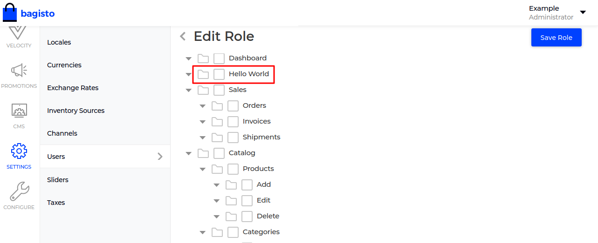

# Create ACL

In term to manage an eCommerce site becomes clumsy and ambiguous. Here, in Bagisto, it has been taken care of, Bagisto has provided a functionality **ACL** (Access Control List). Mainly, with ACL, admin has the power to disable the menu whatever not in use for admin.

## Creating an ACL file

There are some steps that the user has to follow to create ACL. The user has to create a file in the `packages/ACME/HelloWorld/src/Config` path named as `acl.php`,

~~~php
<?php

return [
    [
        'key' => 'helloworld',
        'name' => 'HelloWorld',
        'route' => 'helloworld.admin.index',
        'sort' => 2
    ]
];
~~~

- The array is created for an individual's menu with the parameters (key, name, route, sort). All we need is to define the menu which we want to include in ACL functionality.

- After that for changes, we need to merge the acl config also just like we have done with menu items,

  ~~~php
  <?php

  namespace ACME\HelloWorld\Providers;

  use Illuminate\Support\Facades\Event;
  use Illuminate\Support\ServiceProvider;

  /**
  * HelloWorldServiceProvider
  *
  * @copyright 2020 Webkul Software Pvt. Ltd. (http://www.webkul.com)
  */
  class HelloWorldServiceProvider extends ServiceProvider
  {
      /**
      * Register services.
      *
      * @return void
      */
      public function register()
      {
          $this->mergeConfigFrom(
              dirname(__DIR__) . '/Config/admin-menu.php', 'menu.admin'
          );

          $this->mergeConfigFrom(
              dirname(__DIR__) . '/Config/acl.php', 'acl'
          );
      }
  }
  ~~~

  ::: details Output

    

  :::