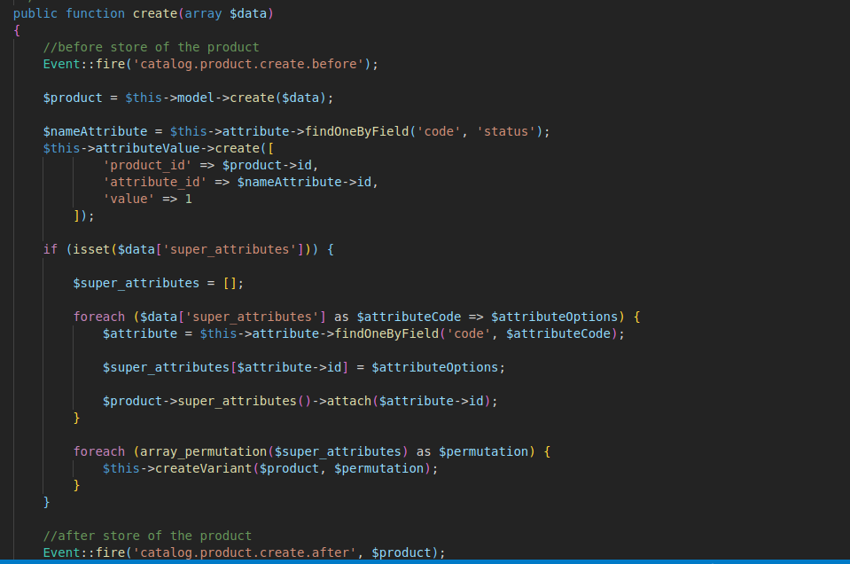
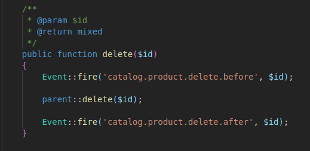

## Events<span class="edit-github"> <a href="https://github.com/bagisto/bagisto-docs">edit on github</a></span>

Events provide a simple observer implementation which allows a user to subscribe and listen to various events triggered in the web application. All the event classes in Bagisto are stored in the `Providers` folder and the listeners are stored in the `Listeners` folder.

#### Manually Registering Events

For the sake of simplicity, in Bagisto, we register events manually in the boot method of your EventServiceProvider as below:

    ```php
    /**
    * Register any other events for your application.
    *
    * @return void
    */
    public function boot()
    {
        parent::boot();

        Event::listen('event.name', 'path-upto-listener@function');
    }
    ```

{: height="50%" width="100%"}


#### Manually Registering Listeners

As we see above, in registering events we specify listener function to be executed when event is called so on every event a listener function is to be executed


### How we specify events?

In most of CRUD operation. We had fired an event before and after the execution of function. So, that if some one want to perform any operation after or before product create/update/delete can perform by simply calling a listener function in event registration

{: height="50%" width="100%"}


{: height="50%" width="100%"}


## Events used in Bagisto


| Events name                     | functionality |
| ------------------------------- | ------------- |
|           :---:                 | :---:         |
| checkout.order.save.after       | This event will be fire after order creation and listen in `ProductFlat` listener file to send new order mail from `sendNewOrderMail` function  |
| sales.invoice.save.after        | This event will be fire after invoice details have been saved and listen in `ProductFlat` listener file to send new invoice mail from `sendNewInvoiceMail` function  |
| sales.shipment.save.after       | This event will be fire after shipment details have been saved and listen in `ProductFlat` listener file to send new shipment mail from `sendNewShipmentMail` function  |
| checkout.order.save.after       | This event will be fire after order has been created  and will listen in `ProductFlat` listener file  to update product inventory from `updateProductInventory` function  |
| catalog.attribute.create.after  | This event will be fire after attribute has created and listen in `ProductFlat` listener file  from `afterAttributeCreatedUpdated` function  |
| catalog.attribute.update.after  | This event will be fire after attribute has updated and listen in `ProductFlat` listener file  from `afterAttributeCreatedUpdated` function  |
| catalog.attribute.delete.before | This event will be fire before attribute has been delete and listen in `ProductFlat` listener file  from `afterAttributeDeleted` function  |
| catalog.product.create.after    | This event will be fire after product has been creation and listen in `ProductFlat` listener file  from `afterProductCreatedUpdated` function  |
| catalog.product.update.after    | This event will be fire after product has been updated and listen in `ProductFlat` listener file  from `afterProductCreatedUpdated` function  |
